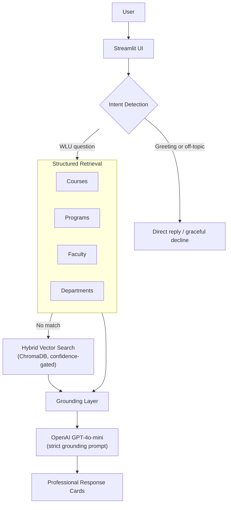
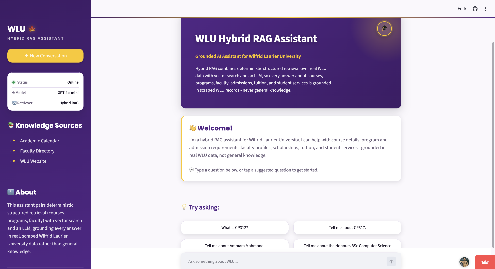

# 🎓 WLU Hybrid RAG Assistant

**A grounded AI assistant for Wilfrid Laurier University, built on a genuine Hybrid Retrieval-Augmented Generation pipeline.**

[](https://www.python.org/)
[](https://streamlit.io/)
[](https://platform.openai.com/)
[](https://www.trychroma.com/)
[](LICENSE)

---

## Project Overview

WLU Hybrid RAG Assistant answers questions about Wilfrid Laurier University — courses, programs, faculty, admissions, tuition, scholarships, student services, and more — without ever relying on a language model's general knowledge.

Every answer is grounded in real, scraped WLU data: the academic calendar and the faculty directory. The assistant tries deterministic, structured retrieval first (direct SQL lookups against dedicated course/program/faculty/department databases); if nothing structured matches, it falls back to semantic vector search over scraped WLU web pages; only when neither path produces an already-complete answer does an LLM synthesize a response — and even then, strictly from the retrieved context, never from its own training data. Questions the retrieved data doesn't support are declined honestly rather than answered with invented specifics, and questions outside WLU's domain are declined gracefully rather than answered at all.

This project was built iteratively, phase by phase, with a full automated regression suite validated after every change — not a one-shot prototype.

---

## Key Features

- **Hybrid RAG Pipeline** — deterministic structured retrieval first, semantic vector search second, LLM synthesis only as a last resort, and only ever grounded in what was actually retrieved.
- **Deterministic Structured Retrieval** — direct SQL lookups across dedicated course, program, faculty, and department databases, bypassing the LLM entirely whenever the data already contains a complete, correct answer.
- **Course Name & Code Lookup** — courses are found by code (`CP312`) or by name (`"Tell me about Operating Systems"`), with automatic clarification when a name matches more than one course.
- **Fuzzy Faculty Matching** — finds faculty by full name, first name, last name, or partial/misspelled name, and asks for clarification instead of guessing when a name is ambiguous.
- **Conversation Memory & Follow-up Resolution** — multi-turn context resolution for pronouns, ordinal references, and topic continuation ("Does it have prerequisites?", "Who teaches it?", "Tell me about the first one.").
- **Hallucination Prevention** — a calibrated confidence gate on vector search, plus deterministic "not found" responses for course codes, faculty names, and programs that don't exist — never a confident, fabricated answer.
- **Grounded Generation** — the LLM's system prompt explicitly forbids stating any fact (tuition figures, scholarship values, deadlines, eligibility rules, statistics) not present in the retrieved context, and requires an explicit "I don't have enough information" instead of guessing.
- **Professional Response Cards** — Course, Faculty, Program, and Department answers render as structured, styled cards (header, metadata grid, sectioned content, footer citation) instead of a wall of text.
- **Source Citations** — every grounded answer links back to the exact WLU page it was drawn from.
- **Off-topic Detection** — questions unrelated to WLU are declined gracefully instead of being answered or fabricated.

---

## Architecture Overview



The diagram above shows the user-facing flow, top to bottom. See **Hybrid RAG Pipeline** below for the nuance it simplifies: a deterministic structured match (a real course, program, faculty, or department record) skips the LLM step completely and renders straight from the database record; follow-up/pronoun resolution and the vector search confidence gate both sit between Structured Retrieval and the Grounding Layer.

---

## Hybrid RAG Pipeline

1. **Intent Detection** — the incoming message is checked for a greeting, ordinary small talk, or an out-of-domain topic first, so those cases never reach retrieval at all.
2. **Deterministic Structured Retrieval** (`structured_search`) — a fixed, ordered cascade of SQL lookups: course-taught queries, prerequisites, program requirements, course lookup (by code or name), program lookup, faculty-level and department-level listings, single department lookup, single faculty lookup, and research-topic search — each tried in an order specifically chosen so a more specific capability never gets shadowed by a more general one.
3. **Follow-up / Contextual Reference Resolution** — if nothing structured matched, the question is checked against conversation memory for an unresolved pronoun, ordinal ("the first one"), or topic-continuation reference before falling further.
4. **Hybrid Vector Search** — only once every deterministic path has failed does the question go to ChromaDB semantic search over scraped WLU pages, reranked using page title/URL metadata and gated by a calibrated distance threshold so a weak semantic match is declined rather than confidently misused.
5. **Grounding Layer** — a response already known to be complete and correct (a real course, program, faculty, or department record) is shown exactly as retrieved, with the LLM never invoked. Everything else is handed to the LLM together with an explicit instruction to state only facts present in that retrieved context.
6. **Professional Response Cards** — the final answer is rendered by a dedicated presentation layer that builds a structured card when the response shape supports it, or a plain conversational reply otherwise.

---

## Technology Stack

| Layer | Technology |
|---|---|
| UI | [Streamlit](https://streamlit.io/) |
| LLM | [OpenAI GPT-4o-mini](https://platform.openai.com/) |
| Vector Search | [ChromaDB](https://www.trychroma.com/) |
| Embeddings | [Sentence Transformers](https://www.sbert.net/) (`all-MiniLM-L6-v2`) |
| Structured Data | SQLite |
| Fuzzy Matching | [RapidFuzz](https://github.com/rapidfuzz/RapidFuzz) |
| Ingestion | BeautifulSoup, Requests |
| Language | Python 3.13 |

---

## Project Structure

```
WLU ChatBot/
├── src/
│   ├── app.py               # Entry point: Streamlit UI, session state, query routing
│   ├── retriever.py         # Structured + vector retrieval, grounding, conversation memory
│   ├── renderer.py          # Course / Faculty / Program / Department card rendering
│   ├── conversation.py      # Small-talk / greeting detection
│   ├── domain_guard.py      # Out-of-domain (off-topic) detection
│   ├── evaluate.py          # Automated regression suite (see Evaluation Results below)
│   ├── scrape*.py, get_*.py, load_*.py, build_*.py
│   │                        # Offline ingestion pipeline: scrapes WLU's website,
│   │                        # builds the SQLite databases and the ChromaDB store
│   └── create_*_table.py    # One-off database schema creation scripts
├── data/
│   ├── courses.db           # Course catalog
│   ├── programs.db          # Program / requirement catalog
│   ├── faculty.db           # Faculty directory
│   ├── departments.db       # Department directory
│   └── vector_db/           # ChromaDB persistent vector store
├── requirements-runtime.txt     # Dependencies to serve the chatbot
├── requirements-ingestion.txt   # + dependencies to run the scraper pipeline
├── requirements-dev.txt         # + dependencies to run the evaluation suite
├── Dockerfile / docker-compose.yml
└── README.md
```

`data/` is produced entirely by the ingestion pipeline and treated as a build artifact — it's only ever read by the live chatbot, never written to at runtime.

---

## Installation Guide

```bash
# 1. Clone the repository
git clone <repository-url>
cd "WLU ChatBot"

# 2. Create and activate a virtual environment
python3 -m venv venv
source venv/bin/activate        # Windows: venv\Scripts\activate

# 3. Install runtime dependencies
pip install -r requirements-runtime.txt
```

If you also want to run the evaluation suite or the ingestion/scraper pipeline, install `requirements-dev.txt` or `requirements-ingestion.txt` instead — see the dependency table below for what each includes.

| Manifest | Purpose |
|---|---|
| `requirements-runtime.txt` | Serve the chatbot only |
| `requirements-ingestion.txt` | Runtime + scraper/loader/vector-db-build pipeline |
| `requirements-dev.txt` | Runtime + ingestion + evaluation suite and dev utilities |

All versions are exact-pinned (`==`), not ranged, so an install today and an install next month resolve to the identical dependency set.

---

## Environment Variables

Create a `.env` file in the project root (never committed — already git-ignored):

```
OPENAI_API_KEY=sk-...
```

This is required for any non-deterministic response (the vector-search fallback, conversational small talk, or LLM-synthesized answers). Deterministic structured answers — a real course, program, faculty, or department record — render without ever calling the OpenAI API.

---

## Running the Application

```bash
streamlit run src/app.py
```

The app is then available at **http://localhost:8501**.

### Running with Docker

```bash
# Build and start via compose (wires up volumes and the .env file automatically)
docker compose up --build
```

`data/` must exist next to the `Dockerfile` before starting the container — it's mounted in as a volume, produced by the ingestion pipeline run outside Docker, and never baked into the image.

---

## Example Queries

**Courses**
- "What is CP312?"
- "Tell me about Operating Systems."
- "Does CP312 require CP220?"
- "Who teaches CP104?"

**Programs**
- "Tell me about the Honours BSc Computer Science program."
- "What is the Master of Applied Computing program?"
- "What are the admission requirements for the MBA?"

**Faculty**
- "Who is Shohini Ghose?"
- "Tell me about Ammara Mahmood."
- "Who researches machine learning?"

**Departments**
- "Tell me about the Economics department."
- "Who works in the Computer Science department?"

**Follow-ups (multi-turn)**
- "Tell me about CP312." → "Does it have prerequisites?" → "Who teaches it?"

**Open-ended**
- "What scholarships are available?"
- "What are the admission requirements?"
- "What support is available for international students?"

---

## Evaluation Results

The project includes a complete, automated regression suite (`src/evaluate.py`) that drives the real Streamlit app end-to-end via `streamlit.testing.v1.AppTest` — not unit tests against internal functions, but the actual application a user would interact with.

```bash
python3 src/evaluate.py
```

**Latest result: 226/226 automated checks passing**, across every shipped capability:

| Category | Result |
|---|---|
| Basic Conversation | 5/5 |
| Conversation Memory | 4/4 |
| Program Retrieval / Aliases / Comparison | 8/8 |
| Undergraduate Programs / Course Requirements | 17/17 |
| Faculty Retrieval | 3/3 |
| Research Topic | 4/4 |
| Courses Taught | 10/10 |
| Person + Topic Courses Taught | 5/5 |
| Department False-Positive Prevention | 9/9 |
| Coordinator / Department Coordinator Lookup | 9/9 |
| Course Prerequisites / Metadata | 8/8 |
| Graduate Program Requirements | 5/5 |
| Multi-Turn Conversations | 5/5 |
| Entity History | 5/5 |
| Out-of-Domain Detection | 6/6 |
| Data Integrity (scraper/extraction correctness) | 123/123 |

**Cross-cutting accuracy metrics** (rolled up across every category above, independent of which capability produced the answer):
- Retrieval accuracy (right feature, correct data): **84/84**
- Clarification accuracy (unresolvable references correctly ask for clarification): **3/3**
- Unsupported-query handling (out-of-scope questions decline gracefully, never fabricate): **16/16**

Beyond the automated suite:
- **Manual browser testing completed** — every major flow (course/program/faculty/department lookup, multi-turn follow-ups, the professional response cards, and the redesigned UI) was independently verified in a real Chromium browser against a live running instance, not just inspected in code.
- **Structured regression testing passed** — a 100-query hand-designed test plan spanning courses, programs, faculty, admissions, scholarships, tuition, student services, multi-turn conversations, edge cases, and invalid queries was run end-to-end against the live app to surface issues automated checks alone wouldn't catch.

---

## Screenshots

> Screenshots are not yet included in this repository. To add them:
>
> 1. Run the app locally (`streamlit run src/app.py`).
> 2. Capture the hero/welcome screen, a Course Card, a Faculty Card, and a multi-turn conversation.
> 3. Save them under `docs/screenshots/` (e.g. `docs/screenshots/hero.png`, `docs/screenshots/course-card.png`) and reference them here:
>
> ```markdown
> 
> 
> 
> ```

---

## Known Limitations

- **Follow-ups need an explicit referring word.** Conversation memory resolves "it", "that", "this", "those", "these", "they", "them", and phrases like "the professor"/"the course", but a natural follow-up with no referring word at all (e.g. "Who is the coordinator?" with no "it") isn't resolved. Gendered pronouns ("she"/"he"/"her"/"him") aren't recognized — only the neutral set above.
- **Deterministic name matching can collide with common words.** Last-name-only faculty matching is intentionally permissive (by design, to support genuine last-name-only queries), which means a query using a word that's also a real faculty surname (e.g. "Dean" as a title vs. Jason Dean as a person) can resolve to the wrong thing.
- **Program comparison expects full official names.** "Compare Computer Science and Business Administration" may not trigger a true side-by-side comparison the way "Compare the Master of Computer Science and Master of Applied Computing programs" reliably does.
- **The scraped corpus doesn't cover every topic.** The crawl that built the vector store is a bounded snapshot of the WLU website; some topics (a dedicated Tuition page, a general Academic Deadlines / Calendar page) were never crawled. For these, the assistant either grounds in the closest genuinely related content or honestly declines — it does not fabricate the missing page.
- **LLM-synthesized answers aren't infallible.** The vector-search fallback path is grounded by an explicit anti-fabrication system prompt, but an LLM's compliance with that instruction, while extensively tested, isn't mathematically guaranteed on every possible phrasing.
- **Not production-hardened.** There is no authentication, rate-limiting, or abuse protection — this is a local/classroom-demo deployment target, not a public-internet-facing service.

---

## Future Improvements

- Expand the crawl to include dedicated Tuition, Scholarships, Student Services, and Academic Deadlines pages, closing the corpus gaps noted above.
- Add gendered-pronoun support ("she"/"he"/"her"/"him") to follow-up resolution.
- Extend program comparison to accept informal or abbreviated program names, not just full official titles.
- Automate the ingestion pipeline (currently a manual sequence of scripts) into a single scheduled or one-command refresh job.
- Add a CI pipeline (e.g. GitHub Actions) that runs `evaluate.py` automatically on every push or pull request.
- Add authentication and rate-limiting before any deployment beyond a local or classroom demo.
- Migrate response cards from HTML-in-Markdown to native Streamlit widgets (`st.container`, `st.columns`) for even tighter framework integration.

---

## License

This project is licensed under the [MIT License](LICENSE).
