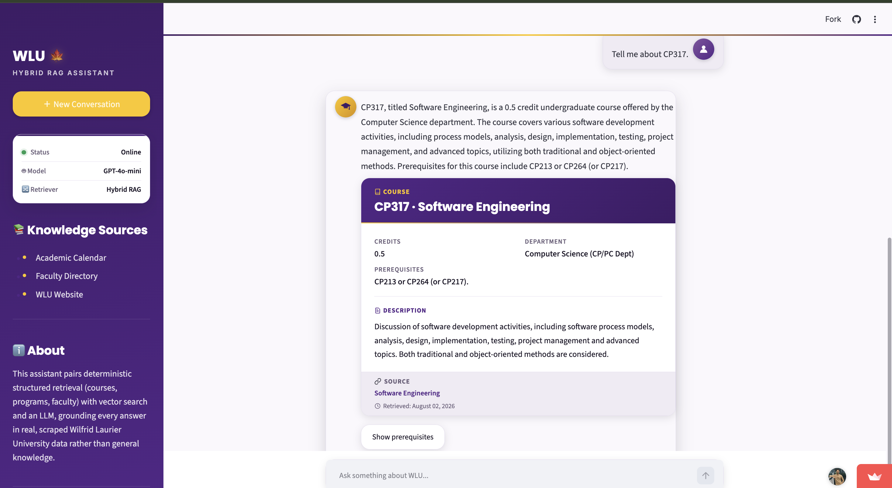

# 🎓 WLU Hybrid RAG Assistant

**A grounded AI assistant for Wilfrid Laurier University, built on a genuine Hybrid Retrieval-Augmented Generation pipeline — dense vector search, BM25, and cross-encoder reranking, layered on top of deterministic structured retrieval.**

[](https://www.python.org/)
[](https://streamlit.io/)
[](https://platform.openai.com/)
[](https://www.trychroma.com/)
[](https://github.com/dorianbrown/rank_bm25)
[](LICENSE)

**🔗 Live demo:** [wlu-hybrid-rag-assistant.streamlit.app](https://wlu-hybrid-rag-assistant.streamlit.app/)

---

## Overview

WLU Hybrid RAG Assistant answers questions about Wilfrid Laurier University — courses, programs, faculty, departments, policies, deadlines, and campus/student services — without ever relying on a language model's general knowledge. Every answer is grounded in real, scraped WLU data: the assistant tries deterministic structured retrieval first, falls back to hybrid semantic + lexical search over scraped web pages, and only ever synthesizes with an LLM strictly from the retrieved context. Questions the data doesn't support are declined honestly instead of answered with invented specifics.

---

## Key Features

- **Hybrid Retrieval Pipeline** — dense vector search and BM25 sparse search run in parallel, merged with Reciprocal Rank Fusion, and reranked by a cross-encoder.
- **Deterministic Structured Retrieval** — direct SQL lookups across course, program, faculty, department, and policy databases, bypassing the LLM entirely when the data already has the answer.
- **Grounded, Hallucination-Resistant Generation** — a calibrated confidence gate plus a strict grounding prompt mean the assistant declines rather than fabricates.
- **Multi-turn Conversation Memory** — resolves pronouns, ordinal references, and follow-ups across every tracked entity type.
- **Source Citations** — every grounded answer links back to the exact WLU page it was drawn from, with a retrieval date.
- **Professional Response Cards** — Course, Faculty, Program, and Department answers render as structured, styled cards, not walls of text.
- **Automated Evaluation Framework** — a regression suite plus a deterministic benchmark validate every change before it ships.
- **Self-Healing Deployment** — the vector database rebuilds itself automatically from committed source data on first launch, with a friendly status message instead of a crash.

---

## Tech Stack

Streamlit · OpenAI GPT-4o-mini · ChromaDB · rank-bm25 · Sentence-Transformers (cross-encoder + embeddings) · SQLite · RapidFuzz · BeautifulSoup / Requests · Python 3.13

---

## Screenshots

### Home Interface


### Chatbot in Action



---

## Installation

```bash
git clone https://github.com/Dileep5/wlu-chatbot-rag.git
cd wlu-chatbot-rag

python3 -m venv venv
source venv/bin/activate        # Windows: venv\Scripts\activate

pip install -r requirements.txt

cp .env.example .env            # add your OPENAI_API_KEY

streamlit run src/app.py
```

The app is then available at **http://localhost:8501**.

---

## Project Structure

```
├── src/                       # App, retrieval, evaluation, and ingestion source
├── data/                      # SQLite databases + ChromaDB vector store
├── evaluation/                # Benchmark data and generator
├── requirements*.txt          # Runtime / ingestion / dev dependency manifests
├── Dockerfile, docker-compose.yml
└── README.md
```

---

## License

This project is licensed under the [MIT License](LICENSE).
