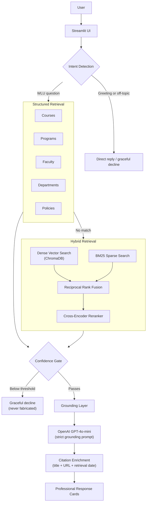

# 🎓 WLU Hybrid RAG Assistant

**A grounded AI assistant for Wilfrid Laurier University, built on a genuine Hybrid Retrieval-Augmented Generation pipeline — dense vector search, BM25, and cross-encoder reranking, layered on top of deterministic structured retrieval.**

[](https://www.python.org/)
[](https://streamlit.io/)
[](https://platform.openai.com/)
[](https://www.trychroma.com/)
[](https://github.com/dorianbrown/rank_bm25)
[](LICENSE)

---

## Project Overview

WLU Hybrid RAG Assistant answers questions about Wilfrid Laurier University — courses, programs, faculty, departments, academic policies, deadlines, campus services, student services, FAQs, admissions, tuition, scholarships, and more — without ever relying on a language model's general knowledge.

Every answer is grounded in real, scraped WLU data. The assistant tries deterministic, structured retrieval first (direct SQL lookups against dedicated course/program/faculty/department/policy databases); if nothing structured matches, it falls back to hybrid semantic + lexical search (dense embeddings, BM25, Reciprocal Rank Fusion, and cross-encoder reranking) over scraped WLU web pages; only when neither path already produces a complete answer does an LLM synthesize a response — and even then, strictly from the retrieved context, never from its own training data. Questions the retrieved data doesn't support are declined honestly rather than answered with invented specifics, and questions outside WLU's domain are declined gracefully rather than answered at all.

This project was built iteratively across a sequence of scoped phases (structured retrieval → hybrid retrieval → corpus expansion → citations → evaluation framework → stabilization), with a full automated regression suite and benchmark validated after every change — not a one-shot prototype.

---

## Key Features

- **Genuine Hybrid Retrieval Pipeline** — dense vector search and BM25 sparse search run in parallel, merged with Reciprocal Rank Fusion, and reranked by a cross-encoder — not a single retriever with a marketing label.
- **Deterministic Structured Retrieval** — direct SQL lookups across dedicated course, program, faculty, department, and policy databases, bypassing the LLM entirely whenever the data already contains a complete, correct answer.
- **Course Name & Code Lookup** — courses are found by code (`CP312`) or by name (`"Tell me about Operating Systems"`), with automatic clarification when a name matches more than one course.
- **Fuzzy Faculty Matching** — finds faculty by full name, first name, last name, or partial/misspelled name, and asks for clarification instead of guessing when a name is ambiguous.
- **Policy Index** — a lightweight structured lookup (policy number, title, source URL) over WLU's official numbered policy library, layered on top of full-text vector search over the policy documents themselves.
- **Reusable Fact-Lookup Pattern** — a question asking for exactly one specific field (a program/department **coordinator**, or a faculty member's **email/phone/office**) returns a concise, focused answer instead of the entire program page or faculty profile. One shared mechanism handles all of it: "coordinator"/"advisor"/"chair"/"director" trigger the same coordinator answer for programs and departments alike; "email"/"phone"/"office" do the same for faculty contact details.
- **Conversation Memory & Follow-up Resolution** — multi-turn context resolution for pronouns, ordinal references, and topic continuation across every entity type the system tracks, including policies (e.g. "What is Policy 12.2?" → "Tell me more.").
- **Hallucination Prevention** — a confidence gate on vector search, calibrated on the best raw dense-embedding match across the full candidate pool (not a reranked candidate's distance — see **Hybrid Retrieval** for why that distinction matters), plus deterministic "not found" responses for course codes, faculty names, programs, and policies that don't exist — never a confident, fabricated answer.
- **Grounded Generation** — the LLM's system prompt explicitly forbids stating any fact not present in the retrieved context, and requires an explicit "I don't have enough information" instead of guessing.
- **Professional Response Cards** — Course, Faculty, Program, and Department answers render as structured, styled cards (header, metadata grid, sectioned content, footer citation) instead of a wall of text — including fact-lookup answers, which get their own clean "Coordinator" card section rather than being swallowed into the title.
- **Source Citations with Retrieval Dates** — every grounded answer links back to the exact WLU page (with its real title, not just a bare URL) it was drawn from, alongside the date that content was retrieved from the live site.
- **Off-topic Detection** — questions unrelated to WLU are declined gracefully instead of being answered or fabricated, with keyword and LLM-fallback coverage spanning every corpus category (courses/programs/faculty through Campus Services/Student Services/FAQs alike).
- **Friendly Error Handling** — an unexpected internal error shows a plain, friendly message in the chat, never a raw Python exception, while the real error is still logged for whoever's operating the app.
- **Automated Evaluation Framework** — a 235-check regression suite plus a 202-question deterministic benchmark spanning eleven categories, auto-generating a full markdown evaluation report on every run.

---

## Architecture Overview



The diagram shows the user-facing flow, top to bottom. A deterministic structured match (a real course, program, faculty, department, or policy record) skips the LLM step completely and renders straight from the database record; follow-up/pronoun resolution, the dense-distance confidence gate, and citation enrichment all sit at specific, deliberate points in this flow rather than being folded into retrieval itself — see **Hybrid Retrieval** and **Citation System** below for exactly where.

---

## Structured Retrieval

`structured_search()` (in `retriever.py`) is a fixed, ordered cascade of direct SQL lookups, tried in an order specifically chosen so a more specific capability never gets shadowed by a more general one:

1. Follow-up memory substitution (a bare "tell me more" after a course/program/department/faculty/**policy** answer resolves against conversation memory before anything else runs)
2. Faculty courses-taught queries (direct, and person + topic)
3. Course prerequisites (direct, reverse, and relational — "does X require Y?")
4. Program course requirements (graduate and undergraduate, including year/term breakdowns)
5. Course lookup (by code or by name, with clarification when a name is ambiguous)
6. Program lookup — a **fact-lookup check runs first**: "coordinator"/"advisor"/"chair"/"director" short-circuits to a concise coordinator-only answer before any of the full program context (description, admission/program requirements) is even assembled; anything else falls through to the full program answer, unchanged
7. Faculty-level and department-level listings
8. Single department lookup — the same fact-lookup check as programs, producing a concise department-coordinator answer
9. Single faculty lookup (fuzzy name matching, with clarification when ambiguous) — a fact-lookup check here recognizes "email"/"phone"/"office" and returns just that field instead of the full profile
10. Research-topic search (semantic, backed by a dedicated faculty-research ChromaDB collection)
11. **Policy index lookup** — gated on the literal word "policy"/"policies" being present (so it can never collide with any other branch), matches by policy number ("What is policy 12.2?") or policy title
12. Course name (last resort — the least specific signal in the cascade)

Every branch that finds a real, complete record renders it directly, with the LLM never invoked — this is what makes structured answers both fast and immune to LLM paraphrasing risk.

Layered after the entity-specific cascade above, a handful of **deterministic aggregate answers** cover broad, entity-less questions that would otherwise have no single winning page for hybrid retrieval to land on ("What programs does WLU offer?", "What graduate programs does WLU offer?", "What faculties are available at WLU?", "Tell me about this university") — each is a live COUNT/list built directly from the same structured databases, never an LLM guess or a vector-search result, and each is checked only after every more specific entity match above has already failed, so none of them can preempt a real single-entity lookup.

**The fact-lookup pattern** (steps 6, 8, and 9 above) is one reusable mechanism, not three bespoke ones: a shared trigger table maps "coordinator"/"advisor"/"chair"/"director" and "email"/"phone"/"office" to the one relevant field on whichever entity was matched, and returns a minimal `"<Entity>: <name>\n<Field>: <value>"` context instead of the entity's full description. It fixed a real bug where a program-coordinator question returned the entire program page (6,630 characters) with the actual answer buried at the bottom — now a 3-line, focused response. The corresponding card renderer (`renderer.py`) was updated alongside it so the answer displays as a clean card (a distinct "Coordinator" section, correctly labeled "🎓 Program" or "🏛️ Department") rather than the coordinator text being swallowed into a garbled card title. One caveat: the trigger words match specific literal forms — "director" (noun) is recognized, "directs" (verb) currently isn't.

---

## Hybrid Retrieval (Dense + BM25 + RRF + Cross-Encoder)

Once structured retrieval and follow-up resolution have both failed to answer a question, it reaches genuine hybrid retrieval (`hybrid_rerank.py`, invoked from `retriever.py`'s `hybrid_search()`):

1. **Dense vector search** — the question is embedded (`all-MiniLM-L6-v2`, local, no API cost) and queried against ChromaDB's `wlu_chatbot_chunks` collection (pool size 15).
2. **Confidence gate** — the calibrated gate (`_VECTOR_SEARCH_DISTANCE_THRESHOLD = 1.2`) decides whether the question is answerable from the corpus **at all**, checked against **the single best raw dense distance across the whole candidate pool** — not a reranked candidate's distance. This step runs before BM25/fusion/reranking ever execute, and is what a query must pass before any further retrieval work happens — the single most important lever against hallucination on out-of-corpus questions.
3. **BM25 sparse search** — only once the gate has passed, a BM25 index (rebuilt automatically, in-memory, whenever the underlying ChromaDB collection's chunk count changes — no app restart needed after a data refresh) is queried in parallel (top 15).
4. **Reciprocal Rank Fusion** — dense and BM25 rankings are merged by rank position (not raw score, since embedding distance and BM25 score live on incompatible scales), using the standard `k=60` constant, producing a fused pool of the top 20 candidates.
5. **Cross-encoder reranking** — `cross-encoder/ms-marco-MiniLM-L-6-v2` scores each (question, chunk) pair directly — a strictly stronger relevance signal than embedding distance or BM25 score alone — and the top-scoring page becomes the answer's source.
6. **Grounding** — only the winning page's own chunks are used as context; the LLM is instructed to state only facts present in that context, with an explicit "I don't have enough information" fallback built into the prompt.

This two-stage design (a gate for "is this answerable," then full hybrid fusion for "which page answers it best") keeps the hallucination-prevention decision and the page-selection decision as two genuinely independent concerns that happen to compose here — BM25/RRF/cross-encoder never influence whether the gate passes, and the gate's own calibration is untouched by whichever page ultimately wins.

**Why "best raw distance, not reranked distance" matters — a real bug, fixed:** an earlier version of the gate checked the distance of whichever candidate an older, simpler metadata reranker (title/URL keyword bonus) had already picked as its favourite for citation purposes. That reranker was reused for the gate's yes/no decision too, but its selection criterion (does the page's *title* share words with the question) doesn't reliably track "is a genuinely relevant page in the pool" — confirmed live: "Where is the Writing Centre?" was declined outright, because a page titled "Accessible Learning **Centre**" won the reranker's vote purely by sharing the word "Centre," at distance 1.221 (over the 1.2 threshold), while a genuinely relevant Student Success page sat in the very same candidate pool at distance 1.098 (comfortably under it) and was never even considered. The fix restores the gate to the original calibration basis it was actually validated against (the 1.19-vs-1.23 in-domain-vs-fabricated split): the closest real match in the pool, full stop — BM25/RRF/cross-encoder are completely unaffected by this fix and still decide page selection exactly as before.

---

## Corpus Expansion

The scraped corpus is built from a modular, quality-filtered ingestion pipeline (`crawler.py` → `scrape.py` → `clean.py` → `chunk.py` → `build_vector_db.py`), combining:

- **A precise, path-filtered academics crawl** — a bounded BFS from the academics section of `www.wlu.ca`.
- **Sitemap-driven section discovery** — real `sitemap.xml` files from `www.wlu.ca` and `students.wlu.ca`, filtered by exact path prefix per category (Policies, Academic Deadlines, Campus Services, Student Services, FAQs), not blind link-following — this is what makes coverage of newer categories precise rather than a broad, noisy crawl.
- **Recency-limited news** — the most recent ~75 news articles by sitemap `<lastmod>`, not the full historical archive (older news content was found to actively hurt vector-search relevance for unrelated queries).
- **A small, capped events crawl** — `events.wlu.ca` has no sitemap, so this is a tightly bounded BFS instead.

**`quality_filter.py`** is a dedicated, modular quality-filter stage (imported by both `crawler.py` and `scrape.py`, not embedded inline in either) responsible for:
- robots.txt compliance (fetched via `requests`, not `urllib`'s own fetch, which was found to fail silently in some environments)
- URL normalization and deduplication
- minimum content-length filtering
- content-type filtering (rejecting non-HTML responses)
- content-level duplicate detection (fingerprinting)

**Current corpus size:**

| Category | Pages crawled | Chunks embedded |
|---|---|---|
| Campus Services | 241 | 674 |
| Academic Advising & Deadlines | 228 | 789 |
| Policies | 175 | 985 |
| Student Services & Wellness | 160 | 486 |
| Academics + other general crawl | 80 | 307 |
| Finances (scholarships/tuition/aid) | 77 | 283 |
| News (recent only) | 75 | 226 |
| Convocation | 73 | 257 |
| FAQ | 14 | 59 |
| Events | 5 | 0 *(see note below)* |
| **Total** | **1,128** | **4,066** |

A later coverage audit found two entire sections that were missing from the original crawl allowlist — **Convocation** (`/academics/convocation/` — graduation dates, applying to graduate, ceremony logistics) and **Finances** (`/finances/` — scholarships, tuition/fee breakdowns, financial aid) — both now included above. Category boundaries have also shifted slightly since the table above was first written: Academic Deadlines is no longer crawled as its own separate section (it's a subpath of Academic Advising, now reported together), so it isn't broken out as its own row the way it once was.

Plus a separate, dedicated **faculty-research vector index** (`wlu_faculty_research`, 588 chunks) backing "who researches X" queries, and a **Policies structured index** (`policies.db`) — 107 policies, indexed by number/title/source URL, layered on top of the full policy text also being vector-searchable.

> **Note on Events:** the events crawl reaches only 5 pages producing 0 usable chunks — `events.wlu.ca` is a JavaScript-rendered calendar with no server-rendered text content; its only machine-readable outputs are JSON/RSS/ICS feeds, which are correctly rejected by content-type filtering. This is a known, accepted gap (see **Known Limitations**), not a bug.

---

## Citation System

Every grounded response carries a citation with three parts: **source page title**, **source URL**, and **retrieval date** — generated automatically, never hardcoded.

- **`data/corpus_metadata.json`** is written automatically at the start of every `crawler.py` run (i.e. every ingestion cycle, including the scheduled weekly refresh), stamping `{"retrieved_at": "<ISO 8601 UTC timestamp>"}`. This is a corpus-wide timestamp — one snapshot date for the whole `data/` directory, matching how the refresh pipeline already treats ingestion as one atomic cycle.
- **`citation.py`** is a presentation-only module, called from `app.py` after retrieval has already finished and already decided on a source — it never influences what gets retrieved. Given a source URL and response type, it resolves:
  - the page **title** — from the matching structured database row (course/program/department/faculty/policy) or, for vector-sourced answers, from the same page-title metadata ChromaDB already stores per chunk
  - the **retrieval date** — read from `corpus_metadata.json`, falling back to the current date only if that file doesn't exist yet
- Multiple sources share a single retrieval date, with each source listed individually — supported by the citation module even though no current response type actually returns more than one source per answer.

---

## Evaluation Framework

Two complementary layers, both run automatically by `python3 src/evaluate.py`:

### 1. Regression Suite (235 checks)
Drives the real Streamlit app end-to-end via `streamlit.testing.v1.AppTest` — not unit tests against internal functions, but the actual application a user would interact with. Covers every shipped capability: conversation, structured retrieval, the fact-lookup pattern (coordinator/advisor/chair/director, faculty email/phone/office), follow-up resolution, hallucination prevention (including a dedicated regression test for the confidence-gate calibration fix), and scraper/extraction data integrity.

### 2. Benchmark (202 questions)
A deterministic, ground-truth benchmark stored entirely as data (`evaluation/benchmark.json`), separate from code, and never generated by an LLM at evaluation time. Generated by `evaluation/generate_benchmark.py`, which pulls real courses/faculty/programs/departments/policies directly from the live databases (deterministic ordering, never random sampling) and validates each candidate question against the live system before including it.

**Category distribution (202 questions):**

| Category | Count |
|---|---|
| Courses | 22 |
| Faculty | 20 |
| Programs | 20 |
| Departments | 16 |
| Policies | 20 |
| Academic Deadlines | 16 |
| Campus Services | 18 |
| Student Services | 18 |
| FAQ | 12 |
| Conversation / Follow-up | 18 |
| Unsupported / Out-of-domain | 22 |

**Latest metrics** (see `evaluation_report.md`, regenerated on every run, for the full breakdown including failed questions and per-category accuracy):

| Metric | Value |
|---|---|
| Answer Accuracy | 100.0% |
| Citation Accuracy | 99.4% (n=163 — questions where a citation was expected) |
| Hallucination Rate | 0.0% (n=22 — see caveat below) |
| Retrieval Success Rate | 100.0% |
| Structured Retrieval Accuracy | 100.0% |
| Hybrid Retrieval Accuracy | 100.0% |
| Average Response Time | ~2.4–2.8s |

**Two honest methodological caveats, documented here rather than left implicit:**
- **Benchmark self-validation.** Structured-category questions are validated against the live system at *generation* time — a candidate entity whose name doesn't cleanly resolve through the system's own fuzzy-matching tiers is excluded rather than kept as a known failure case. Structured/Hybrid Retrieval Accuracy therefore measure *"how well the system performs on entities it can already resolve,"* not *"how well it performs on an unbiased random sample of every real WLU entity."*
- **Hallucination Rate is measured over a small sample (n=22)** and depends on the LLM's grounding-prompt output, which runs at temperature 0.7 — the exact wording of a correct, grounded decline varies call to call. The evaluator recognizes declines via a semantic pattern (negation near an information-availability word: "does not contain," "doesn't specify," "does not define or outline"), which generalizes far better than a fixed phrase list but still cannot claim 100% recall over unbounded LLM phrasing. Recent runs have consistently landed at 0.0% (0 of 22); a single-digit-percent flake (1 of 22, from LLM phrasing variance rather than an actual grounding failure) has been observed on individual runs in the past, so treat one occasional miss on this specific check as expected noise, not a regression, before assuming the detector itself is over- or under-recognizing.

Run the full framework:
```bash
python3 src/evaluate.py
```

---

## Technology Stack

| Layer | Technology |
|---|---|
| UI | [Streamlit](https://streamlit.io/) |
| LLM | [OpenAI GPT-4o-mini](https://platform.openai.com/) |
| Dense Vector Search | [ChromaDB](https://www.trychroma.com/) |
| Sparse Search | [rank-bm25](https://github.com/dorianbrown/rank_bm25) (Okapi BM25) |
| Candidate Fusion | Reciprocal Rank Fusion (custom implementation) |
| Reranking | [Cross-Encoder](https://www.sbert.net/) (`cross-encoder/ms-marco-MiniLM-L-6-v2`) |
| Embeddings | [Sentence Transformers](https://www.sbert.net/) (`all-MiniLM-L6-v2`) |
| Structured Data | SQLite (courses, programs, faculty, departments, policies) |
| Fuzzy Matching | [RapidFuzz](https://github.com/rapidfuzz/RapidFuzz) |
| Ingestion | BeautifulSoup, Requests |
| Language | Python 3.13 |

---

## Project Structure

```
WLU ChatBot/
├── src/
│   ├── app.py                # Entry point: Streamlit UI, session state, query routing
│   ├── retriever.py          # Structured retrieval, conversation memory, grounding
│   ├── hybrid_rerank.py      # BM25, Reciprocal Rank Fusion, cross-encoder reranking
│   ├── citation.py           # Citation enrichment: title + URL + retrieval date
│   ├── renderer.py           # Course / Faculty / Program / Department card rendering
│   ├── conversation.py       # Small-talk / greeting detection
│   ├── domain_guard.py       # Out-of-domain (off-topic) detection
│   ├── quality_filter.py     # robots.txt, URL/content dedup, content-type filtering
│   ├── crawler.py            # Sitemap-driven + BFS crawl discovery
│   ├── evaluate.py           # Regression suite (235 checks) + benchmark runner entry point
│   ├── benchmark_runner.py   # Drives evaluation/benchmark.json through the real app
│   ├── benchmark_report.py   # Generates evaluation_report.md
│   ├── refresh_pipeline.py   # Orchestrates the full ingestion pipeline end-to-end
│   ├── create_policies_table.py, load_policies.py
│   │                         # Policies structured index (schema + loader)
│   ├── scrape.py, clean.py, chunk.py, build_vector_db.py, build_faculty_vector_db.py
│   │                         # Ingestion pipeline: scrape → clean → chunk → embed
│   ├── get_*.py, load_*.py, save_*.py, sync_undergraduate.py
│   │                         # Structured-data scraping/loading (courses, programs, faculty, departments)
│   ├── create_*_table.py     # Database schema creation scripts
│   └── legacy/                # Pre-current-architecture scripts, isolated here -
│                               # not imported by the live app or ingestion pipeline
├── evaluation/
│   ├── benchmark.json         # 202-question deterministic benchmark (data, not code)
│   └── generate_benchmark.py  # Benchmark generator (reads live DBs, self-validates)
├── data/
│   ├── courses.db, programs.db, faculty.db, departments.db, policies.db
│   ├── vector_db/             # ChromaDB persistent vector store
│   └── corpus_metadata.json   # Corpus-wide retrieval timestamp (citation dates)
├── evaluation_report.md       # Auto-generated on every evaluate.py run
├── requirements-runtime.txt   # Dependencies to serve the chatbot
├── requirements-ingestion.txt # + dependencies to run the scraper pipeline
├── requirements-dev.txt       # + dependencies to run the evaluation suite
├── Dockerfile / docker-compose.yml
└── README.md
```

`data/` is produced entirely by the ingestion pipeline and treated as a build artifact — it's only ever read by the live chatbot, never written to at runtime (`corpus_metadata.json` is the one exception, written once per ingestion run, not per query).

> Several early-development / ad hoc debugging scripts (`chatbot.py`, `memory.py`, `intent_classifier.py`, `hybrid_retrieval.py`, `bm25_test.py`, `check_*.py`, `inspect_*.py`, several `test_*.py` scripts) predate the current architecture and live under `src/legacy/`, isolated from the live application and the ingestion pipeline. See **Known Limitations**.

---

## Installation Guide

```bash
# 1. Clone the repository
git clone https://github.com/Dileep5/wlu-chatbot-rag.git
cd wlu-chatbot-rag

# 2. Create and activate a virtual environment
python3 -m venv venv
source venv/bin/activate        # Windows: venv\Scripts\activate

# 3. Install runtime dependencies
pip install -r requirements-runtime.txt
```

If you also want to run the evaluation framework or the ingestion/scraper pipeline, install `requirements-dev.txt` or `requirements-ingestion.txt` instead — see the dependency table below for what each includes.

| Manifest | Purpose |
|---|---|
| `requirements-runtime.txt` | Serve the chatbot only |
| `requirements-ingestion.txt` | Runtime + scraper/loader/vector-db-build pipeline |
| `requirements-dev.txt` | Runtime + ingestion + evaluation framework and dev utilities |

All versions are exact-pinned (`==`), not ranged, so an install today and an install next month resolve to the identical dependency set.

---

## Environment Variables

Copy the provided template and fill in your own key:

```bash
cp .env.example .env
```

```
OPENAI_API_KEY=sk-...
```

This is required for any non-deterministic response (the hybrid-retrieval fallback, conversational small talk, or LLM-synthesized answers) and for the LLM fallback layer of off-topic detection. Deterministic structured answers — a real course, program, faculty, department, or policy record — render without ever calling the OpenAI API. `.env` is git-ignored and never committed.

---

## Running the Application

```bash
streamlit run src/app.py
```

The app is then available at **http://localhost:8501**.

### Running with Docker

```bash
# Build and start via compose (wires up volumes and the .env file automatically)
docker compose up --build
```

`data/` must exist next to the `Dockerfile` before starting the container — it's mounted in as a read-only volume, produced by the ingestion pipeline run outside Docker, and never baked into the image. This includes `data/corpus_metadata.json`; without it, citation dates fall back to the current date rather than the true retrieval date. `evaluation/` and `outputs/` are intentionally excluded from the image (`.dockerignore`) — neither is needed to serve the chatbot.

---

## Data Refresh Pipeline

`src/refresh_pipeline.py` orchestrates the full ingestion pipeline end-to-end by running the existing scripts in dependency order:

1. `crawler.py` → `scrape.py` → `clean.py` → `chunk.py` (sitemap-driven + BFS crawl, quality-filtered scrape, clean, chunk)
2. Rebuild all structured databases — schema reset, then undergraduate calendar sync, graduate calendar sync, faculty directory sync, and the policies index
3. Rebuild the ChromaDB vector databases (content chunks + faculty research interests) — idempotently, so a weekly refresh never accumulates stale duplicate entries

Every step's start/finish time, duration, success/failure, and a page/row count (where derivable) are written to a timestamped log at `logs/refresh_<UTC timestamp>.log`. The pipeline stops at the first failing step, since each later step depends on an earlier one's output.

**Run manually:**

```bash
pip install -r requirements-ingestion.txt
python3 src/refresh_pipeline.py
```

**Run automatically:** [`.github/workflows/weekly-refresh.yml`](.github/workflows/weekly-refresh.yml) runs this same script every Sunday at 06:00 UTC via a scheduled GitHub Actions job, and can also be triggered on demand from the Actions tab (`workflow_dispatch`). On success, it commits the refreshed `data/*.db`, `data/corpus_metadata.json`, `outputs/*.csv`, and `urls.txt` back to `main` and uploads the run's log as a workflow artifact.

This pipeline only touches ingestion — retrieval, ranking, prompting, the response-card renderer, citations, and the evaluation framework are all out of scope for it and are never modified by a refresh run.

---

## Example Queries

**Courses**
- "What is CP312?"
- "Tell me about Operating Systems."
- "Does CP312 require CP220?"
- "Who teaches CP104?"

**Programs**
- "Tell me about the Honours BSc Computer Science program."
- "What is the Master of Applied Computing program?"
- "What are the admission requirements for the MBA?"

**Faculty**
- "Who is Shohini Ghose?"
- "Who researches machine learning?"
- "What is Shohini Ghose's email?" *(fact lookup — returns just the email, not the full profile)*

**Departments**
- "Tell me about the Economics department."
- "Who works in the Computer Science department?"
- "Who is the advisor for the Master of Applied Computing?" *(fact lookup — "advisor"/"chair"/"director" all resolve the same as "coordinator")*

**Policies**
- "What is policy 12.2?"
- "What is the student code of conduct policy?"

**Campus & Student Services**
- "What parking options are available for students?"
- "What support is available for international students?"
- "What are the FAQs for applying to co-op?"

**Academic Deadlines**
- "What is the last day to drop a course without academic penalty?"

**Follow-ups (multi-turn)**
- "Tell me about CP312." → "Does it have prerequisites?" → "Who teaches it?"
- "What is Policy 12.2?" → "Tell me more."

---

## Screenshots

> Screenshots are not yet included in this repository. Recommended set:
>
> | # | Screenshot | Suggested filename |
> |---|---|---|
> | 1 | Hero / welcome screen | `docs/screenshots/hero.png` |
> | 2 | A Course Card response | `docs/screenshots/course-card.png` |
> | 3 | A Faculty Card response | `docs/screenshots/faculty-card.png` |
> | 4 | A Policy answer, showing title + URL + retrieval date citation | `docs/screenshots/policy-citation.png` |
> | 5 | A Campus/Student Services answer (demonstrates corpus expansion) | `docs/screenshots/campus-services.png` |
> | 6 | A multi-turn follow-up conversation (e.g. the policy follow-up) | `docs/screenshots/multi-turn.png` |
> | 7 | A graceful off-topic/hallucination-prevention decline | `docs/screenshots/graceful-decline.png` |
> | 8 | `evaluation_report.md` rendered, or a terminal capture of `evaluate.py`'s summary output | `docs/screenshots/evaluation-summary.png` |
>
> Once captured, reference them here:
>
> ```markdown
> 
> 
> 
> 
> 
> 
> 
> 
> ```

---

## Known Limitations

- **Follow-ups need an explicit referring word.** Conversation memory resolves "it", "that", "this", "those", "these", "they", "them", "she"/"he"/"his"/"her"/"him", and phrases like "the professor"/"the course"/"this program" — across every tracked entity type, including policies — but a natural follow-up with no referring word at all isn't resolved.
- **Deterministic name matching can collide with common words.** Last-name-only faculty matching is intentionally permissive (by design, to support genuine last-name-only queries), which means a query using a word that's also a real faculty surname can resolve to the wrong thing (confirmed example: "What is the capital of **France**?" fuzzy-matches faculty member "**Frances** Stewart"). This is a deliberate precision/recall tradeoff, not an oversight.
- **The `events.wlu.ca` calendar has no usable coverage.** It's a JavaScript-rendered page with no server-rendered content; only non-HTML feeds (JSON/RSS/ICS) are available, which are correctly excluded by content-type filtering. Events questions currently fall back to whatever general context is available, or decline.
- **Undergraduate department coordinators have no data at all (0 of 119 departments).** Graduate department coordinators are scraped correctly (27 of 33 populated, and confirmed clean after the latest data regeneration — see below); the undergraduate extraction path looks for a different page marker (`"[Chair]"`) that doesn't appear to match on current undergraduate department pages at all. Asking for an undergraduate department's coordinator gets a graceful "not available" answer, never a fabricated name — but the answer is never actually populated either. Investigating why the marker stopped matching is real, separate work (see **Future Work**), not something the graduate-side extraction fix touched.
- **News coverage is intentionally recency-limited**, not comprehensive — the ~75 most recent articles by sitemap date, not the full historical archive. This was a deliberate choice after older news content was found to actively reduce retrieval relevance for unrelated queries.
- **LLM-synthesized answers aren't infallible.** The hybrid-retrieval fallback path is grounded by an explicit anti-fabrication system prompt, but an LLM's compliance with that instruction, while extensively tested, isn't mathematically guaranteed on every possible phrasing — and the evaluation framework's own decline-detection has the same fundamental limit (see **Evaluation Framework**).
- **Program comparison expects full official names.** "Compare Computer Science and Business Administration" may not trigger a true side-by-side comparison the way spelling out both full official program titles reliably does.
- **The repository contains legacy development scripts** (`chatbot.py`, `memory.py`, `intent_classifier.py`, `hybrid_retrieval.py`, `bm25_test.py`, several `check_*.py`/`inspect_*.py`/`test_*.py` scripts) that predate the current architecture. They're already isolated under `src/legacy/`, separate from the live application/pipeline code, and are not imported or used by either — see **Project Structure**. A few other one-off root-level artifacts from early development (`log.txt`, a raw debug log; `course_text.txt`, a scrape-test scratch file; `backup_before_app_fix/`, a superseded manual backup — git history already preserves every prior version) are likewise unused by the app and are candidates for removal.
- **Not production-hardened.** There is no authentication, rate-limiting, or abuse protection — this is a local/classroom-demo deployment target, not a public-internet-facing service.

---

## Future Work

- Investigate why undergraduate department pages no longer match the `"[Chair]"` coordinator marker (0 of 119 populated), and fix the extraction the same way the graduate-side over-extraction bug was fixed.
- Remove the legacy development scripts under `src/legacy/` and the other unused root-level artifacts identified above, once confirmed nothing else references them.
- Recognize verb-form fact-lookup triggers ("directs" alongside "director," etc.) in the fact-lookup pattern, not just the currently-recognized noun/gerund forms.
- Investigate a targeted fix for the fuzzy last-name-matching collision class (e.g. "France"/"Frances") without weakening genuine last-name-only queries.
- Extend program comparison to accept informal or abbreviated program names, not just full official titles.
- Add a CI pipeline (e.g. GitHub Actions) that runs `evaluate.py` automatically on every push or pull request — currently only the weekly data-refresh workflow is automated.
- Add authentication and rate-limiting before any deployment beyond a local or classroom demo.
- Investigate real content extraction for `events.wlu.ca` (e.g. parsing its RSS feed directly) rather than relying on its unavailable server-rendered HTML.
- Migrate response cards from HTML-in-Markdown to native Streamlit widgets (`st.container`, `st.columns`) for even tighter framework integration.

---

## License

This project is licensed under the [MIT License](LICENSE).
